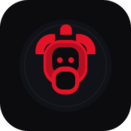
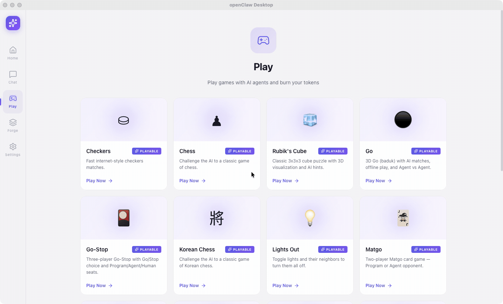
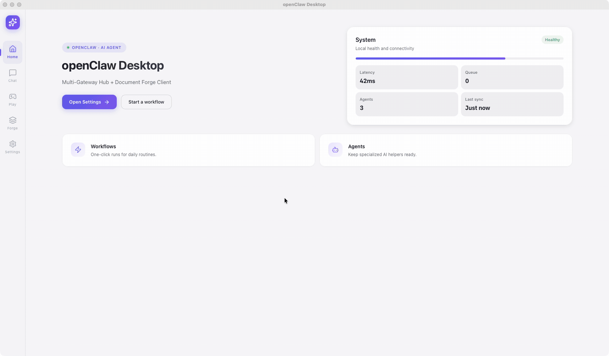
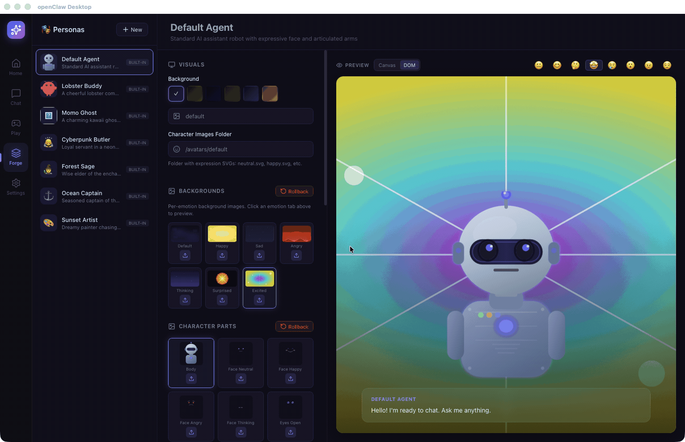
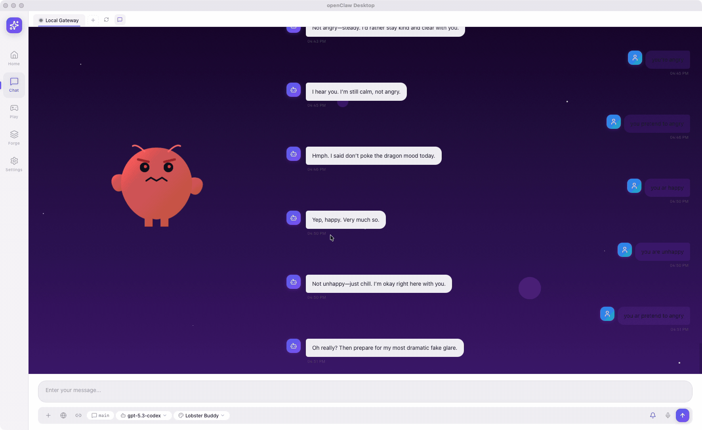

<p align="center">
  
</p>

<h1 align="center">openClaw Desktop</h1>

<p align="center">
  <strong>AI-native desktop app for chat, documents, and games</strong>
</p>

<p align="center">
  <a href="https://github.com/stormixus/openClaw-Desktop/releases"></a>
  <a href="https://github.com/stormixus/openClaw-Desktop/stargazers"></a>
  <a href="https://github.com/stormixus/openClaw-Desktop"></a>
  <a href="https://github.com/stormixus/openClaw-Desktop"></a>
</p>

<p align="center">
  Connect to any AI gateway. Edit documents with AI copilot. Play 14+ games against agents.<br/>
  One app, every workflow.
</p>

---

## Preview

<table>
<tr>
<td width="50%">

**Game Hub**


</td>
<td width="50%">

**Chess — Agent Play**


</td>
</tr>
<tr>
<td width="50%">

**Poker — Texas Hold'em**


</td>
<td width="50%">

**NPC Personas**


</td>
</tr>
<tr>
<td colspan="2">

**Expression & UI Motion**


</td>
</tr>
</table>

---

## Features

**Chat** &mdash; Multi-gateway AI chat with streaming, file uploads, model switching, and session history.

**Forge** &mdash; Open and edit Excel, Word, PDF, PowerPoint, HWP, Markdown, and JSON. AI agents can co-edit documents in real time with approval workflows.

**Games** &mdash; 14+ built-in games (Chess, Poker, Go-Stop, Janggi, 3D puzzles, and more). Play against built-in AI or LLM agents connected via gateway.

**NPC Mode** &mdash; Character-driven conversations with emotion states, actions, dynamic backgrounds, and avatar expressions.

**Multi-Gateway** &mdash; Connect to multiple openClaw gateways simultaneously. Device-level Ed25519 authentication with automatic reconnection.

## Tech Stack

| Layer | Technology |
|-------|-----------|
| Desktop | [Tauri 2](https://v2.tauri.app/) |
| Frontend | [Svelte 5](https://svelte.dev/) + [SvelteKit](https://kit.svelte.dev/) |
| Backend | Rust |
| Editor | [TipTap 3](https://tiptap.dev/) (ProseMirror) |
| 3D | [Three.js](https://threejs.org/) |
| PDF | [PDF.js](https://mozilla.github.io/pdf.js/) |
| Database | SQLite (via rusqlite) |
| Auth | Ed25519 device identity |
| i18n | English, Korean |

## Getting Started

```bash
# Prerequisites: Node.js 18+, Rust stable

# Clone & install
git clone https://github.com/stormixus/openClaw-Desktop.git
cd openClaw-Desktop
npm install

# Run in development
npm run tauri dev

# Build for production
npm run tauri build
```

## Project Structure

```
src/
  routes/          # Pages: chat, forge, play, settings
  lib/
    components/    # UI components (Chat, Forge, Gateway, etc.)
    stores/        # Svelte 5 rune stores
    gateway/       # WebSocket protocol & state
    lang/          # i18n (en, ko)
src-tauri/
  src/
    document/      # Rust: Excel, Word, PDF, PPTX, HWP parsers
    database/      # Rust: SQLite operations
```

> Full documentation available in [`docs/`](./docs/README.md)

## Documentation

| Doc | Description |
|-----|-------------|
| [Architecture](./docs/architecture.md) | System design, state management, data flow |
| [Features](./docs/features.md) | Chat, Forge, NPC, Gateway, Settings specs |
| [Forge](./docs/forge.md) | Document editor: formats, AI integration, patches |
| [Games](./docs/games.md) | 14+ game modules, sound system, agent play |
| [Gateway Protocol](./docs/gateway-protocol.md) | WebSocket v3, auth, events, reconnection |
| [i18n](./docs/i18n.md) | Translation system, key conventions |
| [Development](./docs/development.md) | Setup, conventions, troubleshooting |

## License

Private &mdash; All rights reserved.
